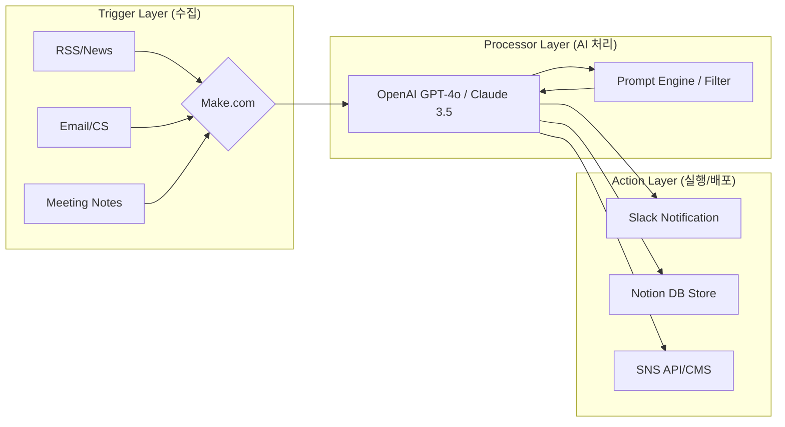

# 💻 Developer — 도출된 자동화 포인트에 적합한 기술 아키텍처 설계, 필요한 API 리스트 작성 및 데이터 파이프라인 초안 구성

💻 Developer: 작업 시작합니다.

Researcher의 분석과 Business의 전략 로드맵을 바탕으로, **[CEO 업무 자동화 시스템]**의 기술 아키텍처 설계 및 데이터 파이프라인 초안을 구성합니다. 

---

## 🏗️ AI 업무 자동화 기술 아키텍처 설계서

### 1. 전체 시스템 아키텍처 (High-Level)
본 시스템은 **`Trigger(수집) → Processor(지능형 처리) → Action(실행/배포)`**의 3단계 레이어로 구성되며, 코딩 최소화와 빠른 배포를 위해 Low-code 플랫폼(`Make`)과 고성능 LLM API를 결합한 하이브리드 구조를 채택합니다.

---

### 2. 데이터 파이프라인 초안 (Detailed Workflow)

#### ① 정보 수집 및 뉴스 요약 파이프라인 (Phase 1)
- **흐름:** `RSS Feed` $\rightarrow$ `Make (Webhook)` $\rightarrow$ `GPT-4o (요약/인사이트 추출)` $\rightarrow$ `Slack (채널 전송)`
- **핵심 로직:** 단순 요약이 아닌, CEO의 관심 키워드와 매칭되는지 판별하는 '필터링 프롬프트' 적용.

#### ② 커뮤니케이션 필터링 파이프라인 (Phase 2)
- **흐름:** `Gmail/Typeform` $\rightarrow$ `Make` $\rightarrow$ `GPT-4o (분류: 긴급/일반/스팸)` $\rightarrow$ `Notion DB (상태 업데이트)` $\rightarrow$ `Slack (긴급 알림)`
- **핵심 로직:** 분류 결과에 따라 Notion의 '우선순위' 속성을 자동 변경하고, [긴급] 건만 CEO에게 즉시 푸시.

#### ③ 콘텐츠 OSMU(One Source Multi Use) 파이프라인 (Phase 1~2)
- **흐름:** `Core Message (Notion/Slack)` $\rightarrow$ `Make` $\rightarrow$ `LLM (플랫폼별 톤앤매너 변환)` $\rightarrow$ `SNS API / Draft Storage`
- **핵심 로직:** 하나의 핵심 아이디어를 [링크드인용 전문글], [인스타그램용 짧은 글], [사내 공지용]으로 각각 다른 프롬프트를 통해 동시 생성.

---

### 3. 필요 API 및 기술 스택 리스트

| 구분 | 도구/서비스 | 용도 | 인증 방식 | 비고 |
| :--- | :--- | :--- | :--- | :--- |
| **Orchestration** | `Make (Integromat)` | 워크플로우 자동화 및 API 연결 허브 | OAuth 2.0 / API Key | 중심 컨트롤러 |
| **LLM Engine** | `OpenAI GPT-4o` | 데이터 분석, 요약, 콘텐츠 생성 | API Key | 추론 및 처리 핵심 |
| **Knowledge Base** | `Notion API` | 데이터베이스 저장 및 상태 관리 | Internal Integration Token | CEO의 대시보드 역할 |
| **Communication** | `Slack API` | 실시간 알림 및 승인 버튼 인터페이스 | Bot Token / OAuth | 최종 결과물 수신처 |
| **Input Source** | `Gmail / RSS Feed` | 외부 데이터 유입 경로 | OAuth 2.0 / XML | 트리거 소스 |

---

### 4. Developer 구현 가이드 (실행 계획)

1. **환경 설정:** `.env` 파일에 각 서비스 API Key 보안 저장 $\rightarrow$ Make.com 연결 설정.
2. **프롬프트 엔지니어링:** CEO의 페르소나가 반영된 `System Prompt` 설계 (예: "너는 샵찰리 CEO의 전략 비서이며, 불필요한 수식어 없이 핵심 인사이트만 보고한다").
3. **에러 핸들링:** API 호출 실패 시 재시도(Retry) 로직 및 관리자 알림 설정 (Make Error Handler 사용).

📊 평가: 완료 — 요청된 아키텍처 설계, API 리스트, 파이프라인 초안 구성이 모두 포함됨.
📝 다음 단계: Phase 1의 '뉴스 요약 자동화'를 위한 구체적인 Make 시나리오 설계 및 프롬프트 작성 시작.
